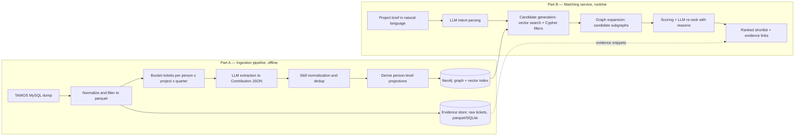

# Capability Graph PoC — Technical Design

**Scope:** proof-of-concept demo on public data. Not the MVP, not production.
**Stack decisions:** TAWOS public Jira dataset · Neo4j + vector index · Jupyter notebook demo · Claude API for extraction/ranking.

---

## 1. What the PoC must prove

1. **Extraction works on real, messy Jira data** — an LLM pipeline can turn raw tickets into evidence-backed Person Contributions with skills and specializations, without human curation.
2. **Graph + vector retrieval returns credible shortlists** — a natural-language project brief comes back as a ranked list of people with inspectable evidence.
3. **It measurably beats naive search** — quantified with a historical-assignee prediction eval (Section 8), so the pitch has a number, not just a vibe.

Explicitly **out of scope**: availability, live Jira API ingestion, identity resolution beyond dataset usernames, access control, feedback loops, UI beyond the notebook, incremental graph updates (we simulate one snapshot + one delta batch to demo the temporal story).

## 2. Dataset

**Primary: [TAWOS](https://github.com/SOLAR-group/TAWOS)** (MSR 2022) — 508,963 Jira issues, 44 projects across 13 repos (Apache, MongoDB, Spring, Atlassian, Hyperledger…), distributed as a MySQL dump. Fields include assignee, reporter, summary, description, components, labels, status, resolution, timestamps, sprints, story points, comments.

**Fallback:** JiraRepos "Public Jira Dataset" (Montgomery et al., MSR 2022; ~2.7M issues, MongoDB dump) if we need more projects; or pull live from `issues.apache.org/jira` REST API if we want to demo real API ingestion.

**Slice for the PoC** (keep it small and dense):

- Pick 4–6 projects with high assignee coverage and distinct domains, e.g. one data-platform (Apache Spark/Flink), one database (MongoDB), one web framework (Spring), one infra (Mesos/Usergrid). Distinct domains make "who fits this brief" queries meaningfully discriminative.
- Keep only people with ≥ 15 resolved tickets → roughly 150–400 "employees". OSS contributors play the role of staff; projects play the role of client engagements.
- Result: ~30–80k tickets feeding ~1,000–2,000 extraction buckets.

**Honest caveat for the pitch:** TAWOS people are software engineers only — no designers/creative technologists. Optionally overlay ~20 synthetic agency-flavored profiles so demo queries can sound like Monks work; label them clearly as synthetic.

## 3. Architecture



Two loosely coupled parts, matching the framing from our earlier discussion: a **persistent, incrementally updatable graph** (fixed schema, dynamic content) and a **query-time ephemeral subgraph** for matching. No per-query graph builds.

## 4. Graph schema

```
(:Person {id, name, projects_count, active_from, active_to})
(:Project {key, name, domain, repo})
(:Contribution {id, summary, period, confidence, evidence_ticket_keys[], embedding})
(:Skill {name, aliases[]})            // fine-grained, e.g. "Kafka", "query optimization"
(:Specialization {name, aliases[]})   // coarse, e.g. "Distributed systems backend"

(Person)-[:MADE]->(Contribution)-[:ON]->(Project)
(Contribution)-[:DEMONSTRATES {strength}]->(Skill|Specialization)
(Person)-[:HAS_SKILL {confidence, evidence_count, last_used, decay_score}]->(Skill)
(Person)-[:HAS_SPECIALIZATION {…same}]->(Specialization)
(Person)-[:COLLABORATED_WITH {tickets_count}]->(Person)   // co-work on same component+period
```

Design choices worth defending:

- **Raw tickets stay OUT of the graph.** 50k ticket nodes would bloat the graph without helping retrieval. Tickets live in a parquet/SQLite evidence store; Contributions carry ticket keys as provenance pointers. The graph stays small (~5–10k nodes), fast, and visualizable.
- **`HAS_SKILL` / `HAS_SPECIALIZATION` are derived projections**, recomputed from Contributions — same pattern as the PRD's `PersonSkill`/`PersonSpecialization`. Ranking reads projections; explanations traverse back to Contributions.
- **Vector index on `Contribution.embedding`** (Neo4j native vector index) — narrative semantic search lives where the graph lives; one store, no sync problem.
- Schema is fixed; content is dynamic. This is the concrete answer to the fixed-vs-dynamic question.

## 5. Part A — Ingestion pipeline

**Stage 0 — Load & normalize.** Restore MySQL dump, filter to chosen projects/people, export normalized tickets to parquet. Pure SQL/pandas, no LLM.

**Stage 1 — Bucketing.** Group tickets per **person × project × quarter** (split buckets over ~30 tickets by component). Rationale: single tickets are too sparse ("fix NPE in FooBar") to infer skills; a quarter of one person's work on one project is a coherent, summarizable unit and keeps LLM calls bounded. Include ticket key, summary, description (truncated), components, labels, resolution.

**Stage 2 — LLM extraction.** One call per bucket → structured JSON:

```json
{
  "contribution_summary": "Led migration of the shuffle service to push-based shuffle...",
  "specializations": [{"name": "Distributed systems backend", "strength": "primary"}],
  "skills": [{"name": "Spark internals"}, {"name": "performance tuning"}],
  "confidence": "high",
  "reason": "Assignee on 14 resolved implementation tickets in the shuffle component",
  "evidence_ticket_keys": ["SPARK-30602", "SPARK-32915"]
}
```

Model: Claude Haiku for the bulk, Sonnet-class spot checks on a 5% sample to validate quality. **Cost estimate:** ~1,500 buckets × ~3k tokens ≈ 5M input tokens → single-digit dollars on Haiku; whole-corpus re-runs are cheap enough to iterate on the prompt.

**Stage 3 — Skill normalization.** Emergent skills arrive as free text ("k8s", "Kubernetes", "container orchestration"). Embed all terms, cluster by cosine similarity (threshold ~0.85), pick a canonical name per cluster, keep aliases. No fixed taxonomy (ESCO/O*NET vocabulary doesn't fit "creative technologist" work anyway — same call the PRD makes). Expect ~300–600 canonical skills, ~30–60 specializations.

**Stage 4 — Projections & decay.** Aggregate Contributions → `HAS_SKILL` edges with `evidence_count`, `last_used`, and a recency decay score (e.g. half-life 18 months). Build `COLLABORATED_WITH` from co-assignment.

**Stage 5 — Load Neo4j.** Bulk load nodes/edges; embed contribution summaries (any strong embedding model; even local sentence-transformers keeps the PoC self-contained) into the vector index.

**Temporal demo:** run Stages 1–5 on data up to time T, then ingest one later quarter as a delta batch — shows the graph updating incrementally without a rebuild, which is the core argument against Microsoft-GraphRAG-style static indexing.

## 6. Part B — Query & matching

**Step 1 — Intent parsing (LLM).** Brief → structured intent:

```json
{
  "roles": [{"role": "backend engineer", "specializations": ["distributed systems"],
             "skills": ["Kafka", "streaming"], "count": 2}],
  "domain": "real-time data platform",
  "constraints": {"recency_years": 3}
}
```

**Step 2 — Candidate generation (union of two retrievers).**
- *Vector:* embed the brief (and each role), top-40 Contributions by cosine → their Persons.
- *Structured:* Cypher over normalized skills/specializations (alias-aware exact + fuzzy match).

Union, not intersection — vector catches phrasing the taxonomy missed; structured catches people whose contribution summaries are dry but whose skill edges are strong.

**Step 3 — Graph expansion.** For each candidate, pull the 1–2 hop subgraph: contributions, skill edges with recency/evidence, collaborations. This subgraph is the ephemeral "query-time graph".

**Step 4 — Scoring & re-rank.** Transparent weighted score first:

```
score = 0.40·specialization_match + 0.25·skill_overlap
      + 0.20·recency_decay + 0.15·evidence_strength
```

Then LLM re-rank of the top ~15 with the subgraph as context, producing a reason per person ("ranked #2: 21 resolved tickets on Flink state backend in the last 2 years — direct match for the streaming role"). Deterministic score does the heavy lifting (cheap, debuggable, tunable); the LLM adds judgment and explanation on a shortlist only.

**Step 5 — Output.** Per role: ranked people, matched skills/specializations, reason, confidence, clickable evidence ticket keys resolved against the evidence store. Latency target: < 10s per query — fine for a demo.

## 7. Trade-offs

| Decision | Chosen | Alternative | Why / cost of choice |
|---|---|---|---|
| Extraction granularity | person × project × quarter buckets | per-ticket / per-person-whole-history | Per-ticket: 30× cost, noisy, weak signal. Whole-history: blows context, loses temporality. Buckets keep provenance per period. |
| Tickets in graph? | No — evidence store outside | Ticket nodes in Neo4j | Graph stays small & demo-visualizable; costs one indirection when showing evidence. |
| Skill taxonomy | Emergent + embedding dedup | Fixed (ESCO/O*NET) or LLM-judged merge | Fixed taxonomies miss agency roles; emergent risks near-duplicates — dedup threshold needs a manual pass (~1h). Matches PRD stance. |
| Store | Neo4j + native vectors | Postgres+pgvector / NetworkX+FAISS | Neo4j gives Cypher, viz, one-store hybrid retrieval; heavier setup (Docker), and at PoC scale honestly overkill — chosen because the *pitch* is graph-shaped and demo viz matters. Note: PRD's relational stance stays valid for MVP; schema translates 1:1. |
| Graph lifecycle | Persistent graph, fixed schema, dynamic content; ephemeral query subgraph | Build graph per query / full periodic rebuild | Per-query builds: slow, expensive, non-reproducible. Full rebuilds: the Microsoft GraphRAG trap. Incremental delta batches demo the production story (Graphiti-style temporal upserts later). |
| Community summaries (MS GraphRAG) | Skip | Precomputed community reports | Only helps corpus-global questions ("what are our capability clusters?") — a nice slide, not the core query. Costly to keep fresh. Revisit post-PoC. |
| Ranking | Weighted score + LLM re-rank of top-K | Pure LLM ranking / pure score | Pure LLM: opaque, unstable, costly over all candidates. Pure score: no nuance, no reasons. Hybrid is the current industry pattern (cf. ConFit v3). |
| Framework | Direct SDK calls (anthropic + neo4j drivers), no LangChain/LlamaIndex | LangChain, LlamaIndex, Graphiti | The pipeline is 5 scripts and 3 prompts; frameworks add debugging surface. Graphiti becomes relevant at MVP when live incremental ingestion starts. |
| Demo | Jupyter notebook | Streamlit app | Chosen per your call — fastest, fine for technical audience. Add `pyvis`/`yfiles-jupyter-graphs` inline graph viz so it still lands visually; Streamlit is a 1–2 day add later if the pitch needs it. |

## 8. Evaluation — the credibility centerpiece

**Temporal holdout, assignee prediction.** Freeze the graph at time T (e.g. covering 2015–2019). Take epics/large tickets resolved after T, use their descriptions as "incoming project briefs", and let the system rank people. Ground truth = who actually did the work.

- Metrics: **Recall@5, Recall@10, MRR** over ~100–200 held-out briefs.
- Baselines: (1) BM25 over raw ticket text, (2) pure vector search, no graph, (3) most-active-person heuristic. The system needs to beat all three for the pitch to claim the graph earns its complexity.
- Plus ~10 qualitative demo queries with hand-checked shortlists, 2–3 phrased as agency briefs.

This eval is the strongest artifact the PoC can produce: "given a real future ticket, the system puts the actual assignee in the top 5 X% of the time, vs Y% for keyword search."

## 9. Notebook demo flow

1. Setup cell: connect Neo4j, load evidence store.
2. Story cell: one person's raw tickets → their extracted Contributions → their profile subgraph (viz). *"From ticket exhaust to capability profile."*
3. Three live queries: shortlist tables with reasons + evidence links, one query graph viz.
4. Delta-batch cell: ingest a new quarter, show a person's profile updating. *"The graph is alive."*
5. Eval cell: metrics table + bar chart vs baselines.

## 10. Plan & effort

Single engineer, roughly three weeks: **W1** data slice + bucketing + extraction prompt iteration (the real work is prompt quality — budget most iteration here); **W2** normalization, graph load, retrieval + ranking; **W3** eval harness, notebook polish, delta-batch demo. LLM spend: < $50 total including re-runs.

## 11. Risks

- **Extraction quality on terse tickets** — biggest risk. Mitigate: bucket granularity, include comments when descriptions are empty, drop buckets below a token floor, human-check a 5% sample.
- **Skill dedup errors** (merging "Java" and "JavaScript" would be embarrassing). Mitigate: conservative threshold + 1-hour manual review of the ~500-term skill list.
- **Eval leakage** — briefs referencing people by name. Mitigate: strip author/assignee mentions from brief text.
- **Domain gap** (OSS ≠ agency work). Mitigate: acknowledge openly; the pipeline is domain-agnostic — that's the point of proving it on messy public data.

## 12. Path from PoC to MVP

The PoC deliberately reuses the PRD's ontology (Contribution, Skill, Specialization, projections, provenance), so promotion is additive, not a rewrite: swap TAWOS loader → curator-mediated ingestion (PRD scope) → Jira API/webhooks; swap dataset usernames → roster identity resolution; add curator review UI; add availability as a runtime filter from Sanskrit; move incremental updates from delta batches → Graphiti-style temporal upserts.

---

**References:** [TAWOS dataset](https://github.com/SOLAR-group/TAWOS) · [TAWOS paper (MSR 2022)](https://solar.cs.ucl.ac.uk/pdf/tawosi2022msr.pdf) · [GraphRAG survey](https://arxiv.org/abs/2501.00309) · [Graphiti temporal KG](https://github.com/getzep/graphiti) · [ConFit v3, LLM re-ranking for person-job fit](https://arxiv.org/abs/2605.09760)
