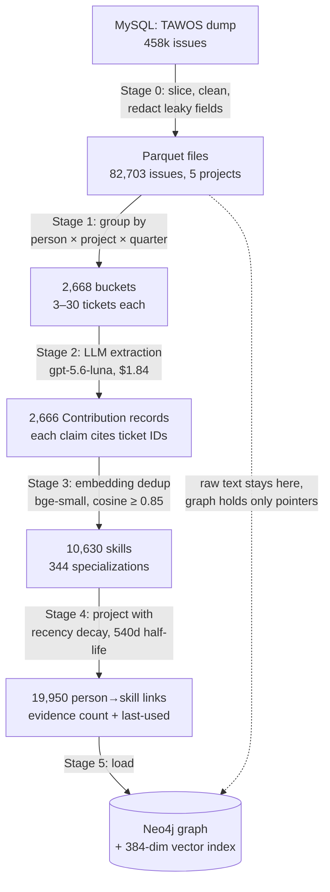
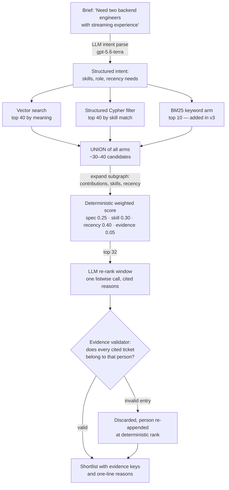

# System deep dive — the data, the design, and every decision

*A learning document for the project owner. Written 2026-08-14 by the
orchestrator. Everything here is traceable to a repo artifact; where a number
appears, the file it comes from is named. Companion documents:
`docs/tech-design.md` (the original design record), `docs/eval-results.md`
(the benchmark record), `docs/manager-pitch.md` (the executive version).*

**How to use this:** read it top to bottom once (about 30 minutes), then use
Part 8 to map sections into your own report. Parts 3–4 are the data flow,
Part 6 is the "why we picked X over Y" ledger, Part 7 is what the experiments
actually taught us.

---

## Part 1 — The idea in one page

**Problem.** Staffing decisions run on human memory: who do I remember doing
something like this? Memory favours visible people, forgets old work, and
lives in a few senior heads. Meanwhile the real record — years of closed
tickets — is unread, because no human can read 60,000 tickets.

**Thesis.** A machine can read that record and turn it into a *capability
memory*: short, dated, evidence-cited notes about what each person actually
did, which can then be searched and ranked against a new piece of work.

**The one non-negotiable design value: every claim carries its evidence.**
Each extracted capability names the ticket IDs it came from, and any
recommendation citing evidence a person doesn't have is automatically thrown
out. This is what separates the system from "an LLM's opinion about people" —
and it's the property that made the whole thing honestly evaluable.

**The shape of the system.** Two halves plus a referee:

- **Part A (offline pipeline, stages 0–5):** ticket dump → evidence slices →
  LLM-extracted contribution records → deduplicated skill vocabulary →
  per-person capability projections → a graph database with a vector index.
- **Part B (query engine):** plain-English request → parsed intent →
  candidates pulled three ways and merged → deterministic arithmetic score →
  LLM re-ranks the top few and writes cited reasons → shortlist.
- **The referee (eval):** a temporal-holdout benchmark that asks the system to
  predict historical assignments it has never seen, under strict anti-cheating
  rules.

Total cost of the entire research track: **$25.20 across 4,203 model calls**,
every one logged in `data/llm_costs.jsonl`.

---

## Part 2 — The data

### What TAWOS is and why we used it

TAWOS is a public research dataset of Jira issue trackers: 458,232 issues
across 39 open-source projects, distributed as a MySQL dump. We used it
because it is the closest public stand-in for the real target (agency ticket
systems): real work descriptions, real assignments, real timelines — and
because using *public, pseudonymous* data means the PoC never touches a real
employee record. That is an ethics choice as much as a convenience.

### The slice we actually processed

Five projects were selected (`MESOS`, `FAB`, `TIMOB`, `DM`, `EVG` — settings
`data.projects`), chosen to balance domain diversity, roster depth, and
post-cutoff headroom for the benchmark. The complete audit is
`data/parquet/slice_report.md`:

| Measure | Value |
|---|---:|
| Issues in the five projects | 82,703 |
| Created before the evaluation cutoff (2019-01-01) | 62,554 |
| People with ≥ 15 pre-cutoff tickets (the profiling threshold) | 316 |
| Per-project roster sizes | 21–105 |

### Quirks of the data, and how each one shaped the design

These are not trivia — several design decisions only make sense once you know
the quirk that forced them (full detail: `docs/data-provenance.md`):

| Quirk | Consequence in our design |
|---|---|
| The `User` table has only an ID and a project ID — no names | People are `<project>:<user_id>` pseudonyms (e.g. `Person MESOS-3360`). We never infer names or link the same human across projects. This is also why bot filtering by name is impossible — the slice report is the source of truth for what's included. |
| Descriptions contain Jira wiki markup and HTML | Stage 0 strips it; text length is capped at 1,200 chars per description before extraction. |
| Final assignee/status fields can be edited *years later* | They are kept for audit but **excluded from all evidence and from the benchmark's ground truth**, which is instead reconstructed at the moment of resolution. This single quirk drives much of the benchmark's design (Part 5). |
| Issues can move between projects; metadata can be internally inconsistent | Such rows are retained for audit but excluded from temporal evidence. |
| No labels table in the v1.1 schema | Stage 0 emits an empty labels list rather than guessing. |

---

## Part 3 — Data flow, Part A: the offline pipeline

**Stage 0 — load and slice** (`pipeline/stage0_load.py`). Reads MySQL, writes
parquet. Two things matter: it *redacts* fields that would leak the future
into evidence (final assignment/status snapshots, unversioned component
names), and it writes `slice_report.md` so "what data went in" is a checkable
fact rather than a recollection.

**Stage 1 — bucketing** (`stage1_bucket.py`). Groups each person's tickets by
project and quarter: 2,668 buckets. Buckets larger than 30 tickets are
deterministically chunked; sparser than 3 are dropped (too little signal).
*Why this granularity* is decision #1 in Part 6 — it is the pipeline's most
consequential choice.

**Stage 2 — extraction** (`stage2_extract.py`). A cheap model
(`openai/gpt-5.6-luna` via OpenRouter) reads each bucket and writes a
Contribution record: what this person did that quarter, in the project's own
vocabulary, with **every claim citing ticket keys from that bucket** — the
"evidence guard". Output: 2,666 contributions, 2 buckets skipped, cost $1.84.
A pilot gate ran first (60 calls, $0.04, manually reviewed —
`docs/stage2-pilot-review.md`) before the full spend was authorized.

**Stage 3 — normalization** (`stage3_normalize.py`). Free-text skill names are
embedded (`BAAI/bge-small-en-v1.5`, 384 dims, runs locally) and near-duplicates
merged by cosine similarity (0.85 for skills, 0.80 for specializations), with
a human term-review pass applied on top. Result: 10,630 skills and 344
broader specializations — a vocabulary that *emerged from the data* rather
than being imposed on it.

**Stage 4 — projections** (`stage4_project.py`). Rolls contributions up into
per-person capability links: 19,950 person→skill/specialization edges, each
carrying evidence count and last-used date, with **recency decay**
(half-life 540 days — work from three years ago counts a fraction of last
quarter's). The benchmark later proved recency is the strongest signal in the
whole scoring formula, so this stage aged well.

**Stage 5 — graph load** (`stage5_graph.py`). Everything lands in Neo4j:
Person, Contribution, Skill, Specialization nodes; a native vector index over
contribution embeddings. **Raw ticket text never enters the graph** — the
graph stores claims plus ticket-key pointers back into parquet.

Every stage is an idempotent CLI with checkpoints (re-runs skip finished
work), reads its knobs from `config/settings.yaml`, and logs cost per stage
with a hard abort if projected spend exceeds its ceiling.

---

## Part 4 — Data flow, Part B: the query engine

Walk through it once slowly:

1. **Intent parse.** A stronger model (`gpt-5.6-terra`) turns the free-text
   brief into structured fields (wanted skills/specializations, role count,
   recency emphasis). This is a model call — which matters later, because it
   makes even "identical" runs slightly different (Part 5, noise floor).
2. **Candidate generation — a union of three pulls.** By *meaning* (vector
   similarity, top 40), by *structure* (Cypher skill-filter, top 40), and — as
   of v3 — by *keyword* (BM25, top 10). The union is deliberate: each arm
   catches people the others miss. Intersection was rejected on day one
   (decision #3), and rank-*fusion* was tried later and measurably lost
   (Part 6, v2 ledger).
3. **Deterministic score.** Four components, weighted (weights are the
   v2-tuned values, from `config/settings.yaml`): specialization match 0.25,
   skill overlap 0.30, **recency 0.40**, evidence strength 0.05. Evidence
   strength saturates as √(n/10) so ten pieces of evidence max it out — and a
   component the candidate has no data for is *dropped and the weights
   renormalized*, not scored zero (this is what lets a keyword-found candidate
   compete fairly). Cheap, explainable, instant.
4. **LLM re-rank.** Only the top 32 go to the model, each rendered as a
   compact "card" (score, top specializations and skills with dates, 3
   citable ticket keys). The model reorders and writes a one-line cited
   reason per person.
5. **The validator.** Every citation is checked against that person's actual
   contributions. An entry citing evidence the person doesn't have is
   discarded — not repaired — and the person re-enters at their deterministic
   rank. No unevidenced claim can reach a shortlist.

**Cost and speed, measured on the benchmark:** the full path is ~$0.032 and
~30s per query; stopping after step 3 (no LLM re-rank) is ~$0.004 and ~3s and
loses almost nothing at top-5/top-10. That asymmetry is finding #1 in Part 7.

---

## Part 5 — The referee: how the benchmark works and why it can be trusted

The benchmark asks one question: *given only what was known when a ticket was
filed, can the system predict who actually did it?* The design difficulty is
that this test cheats by default — the dataset contains the future. Every
guard below exists because of a specific, concrete leak:

| Guard | The leak it prevents |
|---|---|
| The graph sees only work resolved before **2019-01-01**; briefs come only from tickets created after | The system knowing the future in general |
| Brief text is the ticket *as created*, rebuilt from the change log | Later edits and comments often mention who took the job |
| Ground truth is the assignee **reconstructed at the resolution boundary**, never the dump's final assignee field | That field can be edited years later |
| The eligible roster is frozen at the cutoff, per project; naming anyone outside it counts as a failure | Quietly recommending people who joined later |
| Recency is computed *as of each ticket's own date* | "Recent" leaking today's calendar into 2019 |
| Every benchmark build writes a deterministic, versioned manifest (fixed seed, stable IDs, exclusion reasons) | Unreproducible or silently shifting test sets |

**The statistical discipline** — which the three rounds proved is not
optional at this scale:

- **150 cases: 30 for tuning ("validation"), 120 for the real test.** The 120
  were run *exactly once per version* — three versions, three runs — and the
  test set is now retired. A test set you keep peeking at stops being a test.
- **We measured our own noise instead of assuming it.** Re-running an
  identical configuration moved results by up to **0.100** (the intent parse
  is a model call, so retrieval differs slightly run to run). Later, v3
  re-measured the same floor a second, independent way. Consequence: on 30
  validation cases, *any* delta under 0.100 proves nothing — so levers were
  adopted or rejected on **mechanisms** (things true by construction, or
  monotone across an entire sweep), never on a single winning row.
- **Paired statistics.** Every version answers the same cases, so we count
  which specific cases flipped (wins/losses + McNemar's test, bootstrap CIs
  for MRR) instead of watching averages drift.
- **Honest baselines:** plain BM25 keyword search (free, 4ms), pure vector
  search, and "pick the busiest person". If the system can't beat free, that
  would be the finding.

The cautionary tale that justifies all of this: a v3 experiment showed a
lever "winning" 4 cases and losing 0 (p = 0.125) on a metric it **provably
could not affect** — pure retrieval noise wearing a lever's costume. Without
the discipline, that would have been adopted and reported as a gain.

---

## Part 6 — The decision ledger: what we picked, what we didn't, and why

This is the heart of "why X over Y". Two layers: foundational design
decisions (made before any experiment), then experimental decisions (made by
measurement in benchmark rounds v2 and v3).

### 6a. Foundational design decisions

| # | Decision | Alternatives rejected | Why (and what it cost us) |
|---|---|---|---|
| 1 | **Extract per person × project × quarter bucket** | Per-ticket; whole-history | Per-ticket: ~30× the calls, and one ticket is weak evidence of a *capability*. Whole-history: blows the context window and erases the timeline (you can't age evidence you didn't date). Buckets keep provenance per period at 2,668 calls total. Cost of choice: within-quarter ordering is lost — acceptable. |
| 2 | **Raw tickets stay out of the graph** | Ticket nodes in Neo4j | The graph holds claims + ticket-key pointers; text lives in parquet. Keeps the graph small and visualizable, keeps one source of truth, and means the queryable store never contains raw text about people. Cost: one indirection when displaying evidence. |
| 3 | **Candidate generation = UNION of retrieval arms** | Intersection; single best arm | Each arm has a different blind spot; intersection compounds blind spots, union compounds coverage. Later measured: the union's recall ceiling was the system's binding limit until v3 lifted it to 0.975 — by *adding an arm*, exactly as the union design predicts. |
| 4 | **Deterministic score first, LLM re-ranks only top-K** | LLM ranks everyone; score only | LLM-ranking the full pool is opaque, unstable, and linearly expensive. Score-only produces no reasons. The hybrid gives auditability (arithmetic you can print) plus persuasion (cited reasons). Never LLM-rank the full pool — this held through every round. |
| 5 | **Emergent skill vocabulary + embedding dedup** | Fixed taxonomy (ESCO/O*NET); LLM-judged merging | Fixed taxonomies miss real vocabularies (both open-source and agency work). Emergent terms match the PRD's own stance. Cost: near-duplicate terms need a dedup threshold and a human review pass (~1h, done in stage 3). |
| 6 | **Persistent graph, fixed schema, dynamic content** | Rebuild per query; periodic full rebuild | Per-query builds are slow and unreproducible; scheduled full rebuilds are the classic GraphRAG cost trap. One graph, incrementally loadable, queried by many briefs. |
| 7 | **Neo4j (graph + native vectors) for the PoC** | Postgres + pgvector; NetworkX + FAISS | Honest recorded reason: the *pitch* is graph-shaped and demo visualization matters; one store does hybrid retrieval. Also honestly recorded: at this scale it's overkill, and the PRD's relational+vector stance for the MVP remains valid — the benchmark showed the value lives in the evidence pipeline, not the storage engine. |
| 8 | **Cheap model extracts; stronger model parses intent & re-ranks** | One strong model everywhere | Extraction is 2,700 calls of structured summarization — a cheap model passed a manually-reviewed pilot gate. Intent parsing and re-ranking are ~2 calls per query where quality is visible. This split is why the whole track cost $25. |
| 9 | **All model calls through one gateway** (`llm.py`), prompts in files, budgets prospective | Inline calls and prompts | One choke point for retries, JSON parsing, cost logging, per-call ($0.05) and per-stage ceilings with abort. It's why spend never surprised anyone, and why every claim in every report reconciles against one ledger file. |
| 10 | **No LLM frameworks** (LangChain etc.) | LangChain / LlamaIndex / Graphiti | The pipeline is five scripts and a handful of prompts; a framework adds debugging surface without adding capability at this size. |
| 11 | **Pseudonyms only, no cross-project identity** | Inferring identities from patterns | Ethics and data honesty: the dataset doesn't consent to more, and the benchmark doesn't need more. |
| 12 | **Evidence-citation enforcement with a validator** | Trusting the model's citations | The validator turned out to matter: in the current config, 1.25% of offered re-rank entries cite evidence the person doesn't have and are discarded. Without enforcement those would be confident lies in a shortlist. |

### 6b. Experimental decisions — benchmark v2 (tuning the score)

Everything below was decided on 30 validation cases against a measured 0.100
noise floor; full record in `docs/benchmark-v2-config.md`.

| Lever | Verdict | The mechanism that decided it |
|---|---|---|
| **Re-weight the score: recency 0.20→0.40, evidence strength 0.15→0.05** | **Adopted** | Not from the sweep's best row (216 configs over 30 cases will fit noise). From *marginal effects*: recency improved MRR and window recall monotonically across the entire grid — a mechanism, not a lucky row. Evidence strength degraded MRR monotonically: weighted high it becomes "who does the most work here", which is the benchmark's *weakest* baseline. The adopted vector sits inside an 81-point plateau where every neighbour beats v1. |
| RRF rank-fusion of graph × BM25 rankings | Rejected | Fusion assumes comparably good lists. Ours aren't: fusing imported BM25's worse ordering into a better head. Weighted variants recovered *toward* no-fusion as graph weight rose — the tell that the best fusion is none. (Kept: BM25 as a *retrieval arm* instead — v3.) |
| Roster backstop (append everyone unretrieved) | Rejected | Recall hits 1.0 by construction but Hit@K moved ±0.001 — recall without ranking reach is cosmetic at window 15. |
| Assignee-aligned re-rank prompt rewrite | Rejected | Point-estimate worse on all four metrics. A lever with no evidence behind it is not adopted. (Also the first hint of Part 7's finding #2: prompt wording is a noisy, weak lever here.) |
| Stronger re-rank model over the full window | Escalated, not run | Projected past the order's spend line — the governance working as designed. |

### 6c. Experimental decisions — benchmark v3 (recall and the re-rank)

Full record: `docs/benchmark-v3-config.md`. Levers came from a two-agent
literature survey (issue-triage SOTA + LLM-reranking best practice), then were
re-derived on our own validation split before any money was spent.

| Lever | Verdict | The mechanism that decided it |
|---|---|---|
| **BM25 keyword arm in the retrieval union (top 10)** | **Adopted** | On validation, candidate recall 0.967 → **1.000 by construction**, for a median of one extra candidate per pool. Required one honest engine change: keyword-found candidates had no relevance source and scored a structural zero, so scoring falls back to their retained contributions (provably unreachable for any earlier candidate — pinned by a test). |
| **Compact candidate "cards" in the re-rank prompt** | **Adopted** | Re-rank cost −38%, which is what paid for the wider window. (Its other claimed benefit — citation rejections 8→0 — held at window 15 but *not* at 32; the record was corrected in writing rather than left standing. See Part 7, finding #5.) |
| **Re-rank window 15 → 32** | **Adopted** | By construction: 32 exceeds the deterministic rank of every pool-resident truth on validation (max 27), so window recall = candidate recall = 1.000. The only lever that removes a hard ceiling rather than reshuffling under it. |
| Permutation self-consistency (3 shuffled re-ranks, vote) | Rejected | The literature's standard fix for position bias — and the study's only confidence interval excluding zero pointed *down* (MRR −0.080, CI [−0.156, −0.014]), at 3.1× cost. Mechanism: shuffling is right when input order is uninformative; ours *is* informative (it's the deterministic score), so shuffling destroys signal and votes over three noisier lists. |
| Strong-model finisher on the top 5 | Rejected | Negative on both metrics it could reach. Its *apparent* +0.133 Hit@5 was impossible (all four "wins" were cases where it can't change the top-5 set) — the study's clearest proof that small-sample win/loss tables lie. |
| HyDE query expansion, embedding swap, SPLADE/ColBERT, CoT rerankers, LLM fine-tuning | Not attempted | Each has published evidence *against* it in our regime (expansion hurts non-weak retrievers; a same-dim embedding swap buys ~0.3 MTEB points for a full reindex; heavy retrieval infra is pointless at 2,666 documents; fine-tuned 8B lost to a graph baseline). Recorded as don'ts with citations in the v3 order. |

---

## Part 7 — What the experiments actually taught us

Five findings, in order of importance for what comes next:

**1. The cheap arithmetic does most of the work; the LLM re-rank is the
bottleneck, not the engine.** By v2 it was measurable: feeding the re-rank a
*better-ordered* candidate list produced the same output. By v3 it was
conclusive: with retrieval essentially solved (recall 0.975, window recall
1.000), the full system still couldn't convert the headroom — top-10 rose to
0.833 but top-1 *fell* to 0.225, below free keyword search. Meanwhile the
deterministic arm reached Hit@10 0.808 at ~1/8 the cost and ~1/10 the
latency. Product translation: rank cheaply for breadth, spend the model call
only where a human needs a persuasive, cited explanation.

**2. Recency beats depth.** The strongest single signal for "who will take
this ticket" is *who is working in this area now* — recency earned weight
0.40, and raw evidence volume collapsed to 0.05 because at high weight it
degenerates into "pick the busiest person" (the worst baseline, Hit@1 0.042).
This validates stage 4's recency decay and should carry into any MVP scoring.

**3. Retrieval is a solved problem at this scale; ranking judgment is not.**
Union-of-arms plus a keyword arm gets the right person into the pool 97.5% of
the time for cents. Both literature-endorsed fixes for the ranking stage
(sampling+voting, a stronger finisher model) failed *here* — imported
best practices must be re-derived on your own data before you pay for them.

**4. At small evaluation scale, noise eats effects — so measure the noise.**
Run-to-run variance of a *supposedly identical* configuration was 0.100; most
published-lever effect sizes are smaller. Without a measured floor, this
project would have "adopted" several improvements that were coin flips. The
methodology (frozen splits, one test run per version, paired stats, measured
noise, mechanism-based adoption) is arguably the most reusable artifact of
the whole track.

**5. The honesty machinery paid for itself, literally.** A frozen-config
claim that didn't generalize was corrected in writing; an impossible "win"
was caught and named; a worker's accidental test-split peek was disclosed and
quarantined; every dollar reconciles to one ledger. The result is a set of
numbers you can hand a skeptical manager without flinching — which, for a
system that ranks *people*, is the difference between a tool and a liability.

And the external calibration: published systems on comparable team sizes
report top-1 ≈ 0.33 / top-10 ≈ 0.81; our v2/v3 sit at 0.308/0.775 and
0.225/0.833. The literature also finds 18–44% of historical "who did this"
labels contestable — a ceiling everyone in this field shares.

---

## Part 8 — Finding your way around, and turning this into a report

### Where everything lives

| You want | Look in |
|---|---|
| Original design + trade-off table | `docs/tech-design.md` (§7 is the trade-offs) |
| Every benchmark number, all versions | `docs/eval-results.md` |
| Why each v2/v3 lever was adopted/rejected | `docs/benchmark-v2-config.md`, `docs/benchmark-v3-config.md` |
| The work orders + acceptance records (the project's audit trail) | `docs/work-orders/*.md` |
| Executive narrative | `docs/manager-pitch.md` |
| Data audit: what went in, what was excluded | `data/parquet/slice_report.md`, `docs/data-provenance.md` |
| Spend, call by call | `data/llm_costs.jsonl` |
| All knobs (weights, windows, models, thresholds) | `config/settings.yaml` |
| The code: pipeline / query / eval | `src/capgraph/pipeline/` · `src/capgraph/query/` · `src/capgraph/eval/` |
| MVP scope this feeds into | `prd (1).md` (yours), `docs/direction-decision.md` |

To trace any number in any doc: the pitch and this doc name their source
files; benchmark tables regenerate offline via `make eval` from checkpointed
runs (the frozen v1/v2/v3 sections are archival — don't regenerate those).

### Suggested report structure (maps to this doc)

1. *Problem & approach* → Part 1 (+ pitch §1)
2. *Data & its limits* → Part 2
3. *System design with data flow diagrams* → Parts 3–4 (the two mermaid
   diagrams render directly on GitHub)
4. *Evaluation methodology* → Part 5 — lead with *why* each guard exists;
   this is where credibility is won
5. *Design rationale* → Part 6 ledger, trimmed to the decisions your audience
   will question
6. *Results & findings* → Part 7 + the pitch's tables (transcribe, don't
   recompute)
7. *Limitations & ethics* → pitch §5 (use it verbatim; it's deliberately
   unhedged)
8. *From PoC to MVP* → pitch §6 + PRD mapping

### Glossary (the six terms worth internalizing)

- **Contribution** — one extracted record: person × project × quarter, what
  they did, citing ticket IDs.
- **Candidate recall** — how often the right person makes it into the working
  pool at all. A ceiling on everything downstream.
- **Window recall** — how often the right person is among the top-K the LLM
  actually sees. The re-rank can't rank someone it wasn't shown.
- **Hit@K / MRR** — was the right person in the top K / a single number
  rewarding higher placement.
- **Temporal holdout** — evaluate by predicting a past the system wasn't
  allowed to see.
- **Noise floor** — how much results move when you change *nothing*. Here:
  0.100. Any smaller "improvement" is unproven.
