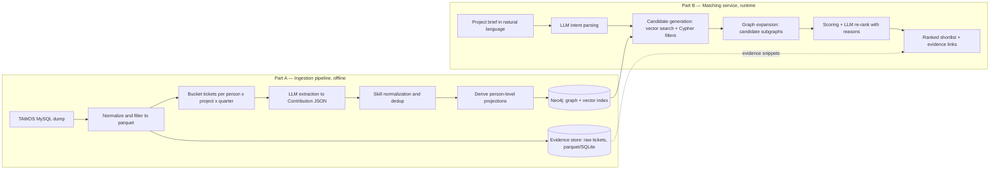

# Capability Graph PoC — Technical Design

**Scope:** research/evaluation proof of concept on public data. Not the MVP, not
production, and not employment decision support.
**Stack decisions:** TAWOS public Jira dataset · Neo4j + vector index · Jupyter notebook demo · Claude API for extraction/ranking.

**Current implementation phase:** establish reproducible TAWOS v1.1 ingestion,
slice reporting, and a leakage-safe benchmark manifest. Graph construction,
retrieval, and LLM stages are deferred.

---

## 1. What the PoC must prove

1. **Extraction works on real, messy Jira data** — an LLM pipeline can turn raw tickets into evidence-backed Person Contributions with skills and specializations, without human curation.
2. **Graph + vector retrieval returns credible shortlists** — a natural-language project brief comes back as a ranked list of people with inspectable evidence.
3. **It measurably beats naive search** — quantified with a historical-assignee prediction eval (Section 8), so the pitch has a number, not just a vibe.

Explicitly **out of scope**: availability, live Jira API ingestion, person-name or cross-project identity resolution, access control, feedback loops, UI beyond the notebook, incremental graph updates (a later phase may simulate one snapshot + one delta batch to demo the temporal story).

## 2. Dataset

**Primary:** [TAWOS v1.1 on the UCL Research Data
Repository](https://rdr.ucl.ac.uk/articles/dataset/The_TAWOS_dataset/21308124)
(MSR 2022) — 458,232 Jira issues, 39 projects, and 12 repositories,
distributed as a MySQL dump. The 508,963-issue/44-project/13-repository figures
describe obsolete v1.0. See [`data-provenance.md`](data-provenance.md) for the
verified archive size/checksums, DOI, license, and handling notes, and use the
[official schema](https://github.com/SOLAR-group/TAWOS/blob/main/TAWOS_Database_Schema_Creation_Script.sql)
for all joins.

TAWOS's official [Terms of
Use](https://github.com/SOLAR-group/TAWOS#terms-of-use) restrict the dataset to
researchers using it for research purposes and require consideration of harmful
use and re-identification risk. This PoC evaluates historical assignment
prediction only; it must not be used for real hiring, staffing, promotion,
performance, or other employment decisions.

The v1.1 `User` table contains only `ID` and `Project_ID`; it has no person names
or reliable cross-project identity. A benchmark person is therefore the
project-local `<project_key>:<user_id>`, displayed only as the explicit pseudonym
`Person <project_key>-<user_id>`. The schema has no labels table, so normalized
tickets carry an empty labels list. Never invent names, labels, or cross-project
identity.

This benchmark does not substitute another corpus or live Jira data for the pinned
v1.1 artifact.

**Slice for the PoC** (keep it small and dense):

- The reproducible report in `data/parquet/slice_report.{md,csv}` covers every
  project with total/resolved tickets, assignee and text coverage, distinct
  assignees, date range, pre/post-cutoff counts, assignees with at least 15
  pre-cutoff resolved tickets, and plausible held-out briefs.
- The recommended slice is MESOS, FAB, TIMOB, DM, and EVG. It spans distributed
  systems, ledger infrastructure, mobile tooling, scientific data management,
  and database CI. Every selected project has at
  least 64% assignee coverage. USERGRID and MULE yield no plausible held-out
  briefs; provisional TISTUD yields only 17 after temporal exclusions, so DM
  replaces it with substantially better benchmark headroom. CXX is also left out:
  its 15-person roster and 23-brief pool make Hit@10 and per-project estimates too
  coarse for the primary slice.
- Apply the ≥15 resolved-ticket threshold using pre-cutoff history only. These
  project-scoped OSS assignee IDs are benchmark candidates, not verified
  employees or proof of qualification.
- Record the chosen project-domain mapping in configuration and propagate it to
  every extraction bucket.

Across the recommended projects, the report contains 82,703 issues, 62,554
created before cutoff, 316 project-qualified people meeting the pre-cutoff
ticket threshold, and 3,594 upper-bound plausible held-out issues before final
retained-profile and creation-text manifest exclusions. The configured
quantitative benchmark deterministically
samples up to 150 briefs; strict leakage/exclusion rules may reduce that count.

**Honest caveat for the pitch:** TAWOS represents public software-project work,
not an agency roster. Synthetic profiles must not be added to the quantitative
benchmark.

## 3. Architecture



Two loosely coupled parts, matching the framing from our earlier discussion: a **persistent, incrementally updatable graph** (fixed schema, dynamic content) and a **query-time ephemeral subgraph** for matching. No per-query graph builds.

## 4. Graph schema

```
(:Person {id, pseudonym, project_key, active_from, active_to})
(:Project {key, name, domain, repo})
(:Contribution {id, summary, period, confidence, evidence_ticket_keys[], embedding})
(:Skill {name, aliases[]})            // fine-grained, e.g. "Kafka", "query optimization"
(:Specialization {name, aliases[]})   // coarse, e.g. "Distributed systems backend"

(Person)-[:MADE]->(Contribution)-[:ON]->(Project)
(Contribution)-[:DEMONSTRATES {strength}]->(Skill|Specialization)
(Person)-[:HAS_SKILL {confidence, evidence_count, last_used, decay_score}]->(Skill)
(Person)-[:HAS_SPECIALIZATION {…same}]->(Specialization)
(Person)-[:COLLABORATED_WITH {tickets_count}]->(Person)   // later: needs versioned co-work data
```

Design choices worth defending:

- **Raw tickets stay OUT of the graph.** 50k ticket nodes would bloat the graph without helping retrieval. Tickets live in a parquet/SQLite evidence store; Contributions carry ticket keys as provenance pointers. The graph stays small (~5–10k nodes), fast, and visualizable.
- **`HAS_SKILL` / `HAS_SPECIALIZATION` are derived projections**, recomputed from Contributions — same pattern as the PRD's `PersonSkill`/`PersonSpecialization`. Ranking reads projections; explanations traverse back to Contributions.
- **Vector index on `Contribution.embedding`** (Neo4j native vector index) — narrative semantic search lives where the graph lives; one store, no sync problem.
- Schema is fixed; content is dynamic. This is the concrete answer to the fixed-vs-dynamic question.

## 5. Part A — Ingestion pipeline

**Stage 0 — Load & normalize.** Restore the verified v1.1 MySQL dump; join the
real Project, Issue, project-local User, and Component structures, and use Comment
only for report coverage; report every project; then export every configured issue
to parquet for audit. Creation-time summary/description and resolution-time owner
are reconstructed from `Change_Log`. Dated resolution transitions can only move
the evidence boundary later. Project/key moves, explicit resolution-date edits,
undated resolution changes, and a latest transition that clears resolution remain
in the audit export with an exclusion reason
but cannot enter rosters, profiles, or manifests. The final assignee/project/key are
audit fields, not benchmark truth; raw `Resolution_Date` is preserved separately
from the safe evidence boundary. Filtering the roster and enforcing the minimum
ticket threshold use only safely created-and-resolved pre-cutoff history. The
Stage 0 people roster additionally requires that this history yield at least one
retained Stage 1 bucket. Comments
are never substituted; labels are empty because v1.1 has no labels table; opaque
IDs do not support name-based bot filtering. Pure SQL/pandas, no LLM.

**Stage 1 — Bucketing.** Group tickets per **resolution-time owner × project ×
quarter** and deterministically chunk groups over ~30 tickets, rebalancing a short
tail so every qualifying ticket appears exactly once and configured minimum/maximum
sizes hold whenever mathematically possible. Single tickets are
too sparse ("fix NPE in FooBar") to infer skills; a quarter of one person's work on
one project is a coherent unit. The evidence view contains stable source issue ID,
unchanged key, creation-time summary/description, and safe dates. Final assignee,
type, resolution, and unversioned `Component.Name` values are redacted. Components
remain deterministically aggregated in Stage 0 for source audit but cannot affect
temporal bucket membership or extraction.

**Stage 2 — LLM extraction.** One call per bucket → structured JSON:

```json
{
  "contribution_summary": "Led migration of the shuffle service to push-based shuffle...",
  "specializations": [{"name": "Distributed systems backend", "strength": "primary"}],
  "skills": [{"name": "Spark internals"}, {"name": "performance tuning"}],
  "confidence": "high",
  "reason": "Fourteen safe evidence tickets consistently describe shuffle-service work",
  "evidence_ticket_keys": ["SPARK-30602", "SPARK-32915"]
}
```

Model: Claude Haiku for the bulk, Sonnet-class spot checks on a 5% sample to validate quality. **Cost estimate:** ~1,500 buckets × ~3k tokens ≈ 5M input tokens → single-digit dollars on Haiku; whole-corpus re-runs are cheap enough to iterate on the prompt.

**Stage 3 — Skill normalization.** Emergent skills arrive as free text ("k8s", "Kubernetes", "container orchestration"). Embed all terms, cluster by cosine similarity (threshold ~0.85), pick a canonical name per cluster, keep aliases. No fixed taxonomy (ESCO/O*NET vocabulary doesn't fit "creative technologist" work anyway — same call the PRD makes). Expect ~300–600 canonical skills, ~30–60 specializations.

**Stage 4 — Projections & decay.** Aggregate Contributions → `HAS_SKILL` edges
with `evidence_count`, `last_used`, and a recency decay score (e.g. half-life 18
months). Compute decay as of the frozen cutoff/query time, never the machine's
current date. `COLLABORATED_WITH` is deferred until a versioned co-work signal is
available; the unversioned TAWOS component snapshot is not sufficient.

**Stage 5 — Load Neo4j.** Bulk load nodes/edges; embed contribution summaries (any strong embedding model; even local sentence-transformers keeps the PoC self-contained) into the vector index.

**Temporal demo:** run Stages 1–5 on data up to time T, then ingest one later quarter as a delta batch — shows the graph updating incrementally without a rebuild, which is the core argument against Microsoft-GraphRAG-style static indexing.

## 6. Part B — Query & matching

**Step 1 — Intent parsing (LLM).** Brief → structured intent:

```json
{
  "roles": [{"role": "backend engineer", "specializations": ["distributed systems"],
             "skills": ["Kafka", "streaming"], "count": 2}],
  "domain": "real-time data platform",
  "constraints": {"recency_years": 3}
}
```

**Step 2 — Candidate generation (union of two retrievers).**
- *Vector:* embed the brief (and each role), top-40 Contributions by cosine → their Persons.
- *Structured:* Cypher over normalized skills/specializations (alias-aware exact + fuzzy match).

Union, not intersection — vector catches phrasing the taxonomy missed; structured catches people whose contribution summaries are dry but whose skill edges are strong.

**Step 3 — Graph expansion.** For each candidate, pull the 1–2 hop subgraph: contributions, skill edges with recency/evidence, collaborations. This subgraph is the ephemeral "query-time graph".

**Step 4 — Scoring & re-rank.** Transparent weighted score first:

```
score = 0.40·specialization_match + 0.25·skill_overlap
      + 0.20·recency_decay + 0.15·evidence_strength
```

> The weights above are the original design values and were used for the v1 benchmark.
> They live in `config/settings.yaml` (`scoring.weights`), which is the single source of
> truth, and benchmark v2 re-tuned them on the validation split to
> `0.25 / 0.30 / 0.40 / 0.05` — more weight on recency, much less on evidence volume.
> The rationale is in `docs/benchmark-v2-config.md`; the shape of the score is unchanged.

Then LLM re-rank of the top ~15 with the subgraph as context, producing a reason per person ("ranked #2: 21 resolved tickets on Flink state backend in the last 2 years — direct match for the streaming role"). Deterministic score does the heavy lifting (cheap, debuggable, tunable); the LLM adds judgment and explanation on a shortlist only.

**Step 5 — Output.** Per role: ranked people, matched skills/specializations, reason, confidence, clickable evidence ticket keys resolved against the evidence store. Latency target: < 10s per query — fine for a demo.

## 7. Trade-offs

| Decision | Chosen | Alternative | Why / cost of choice |
|---|---|---|---|
| Extraction granularity | person × project × quarter buckets | per-ticket / per-person-whole-history | Per-ticket: 30× cost, noisy, weak signal. Whole-history: blows context, loses temporality. Buckets keep provenance per period. |
| Tickets in graph? | No — evidence store outside | Ticket nodes in Neo4j | Graph stays small & demo-visualizable; costs one indirection when showing evidence. |
| Skill taxonomy | Emergent + embedding dedup | Fixed (ESCO/O*NET) or LLM-judged merge | Fixed taxonomies miss agency roles; emergent risks near-duplicates — dedup threshold needs a manual pass (~1h). Matches PRD stance. |
| Store | Neo4j + native vectors | Postgres+pgvector / NetworkX+FAISS | Neo4j gives Cypher, viz, one-store hybrid retrieval; heavier setup (Docker), and at PoC scale honestly overkill — chosen because the *pitch* is graph-shaped and demo viz matters. Note: PRD's relational stance stays valid for MVP; schema translates 1:1. |
| Graph lifecycle | Persistent graph, fixed schema, dynamic content; ephemeral query subgraph | Build graph per query / full periodic rebuild | Per-query builds: slow, expensive, non-reproducible. Full rebuilds: the Microsoft GraphRAG trap. Incremental delta batches demo the production story (Graphiti-style temporal upserts later). |
| Community summaries (MS GraphRAG) | Skip | Precomputed community reports | Only helps corpus-global questions ("what are our capability clusters?") — a nice slide, not the core query. Costly to keep fresh. Revisit post-PoC. |
| Ranking | Weighted score + LLM re-rank of top-K | Pure LLM ranking / pure score | Pure LLM: opaque, unstable, costly over all candidates. Pure score: no nuance, no reasons. Hybrid is the current industry pattern (cf. ConFit v3). |
| Framework | Direct SDK calls (anthropic + neo4j drivers), no LangChain/LlamaIndex | LangChain, LlamaIndex, Graphiti | The pipeline is 5 scripts and 3 prompts; frameworks add debugging surface. Graphiti becomes relevant at MVP when live incremental ingestion starts. |
| Demo | Jupyter notebook | Streamlit app | Chosen per your call — fastest, fine for technical audience. Add `pyvis`/`yfiles-jupyter-graphs` inline graph viz so it still lands visually; Streamlit is a 1–2 day add later if the pitch needs it. |

## 8. Evaluation — the credibility centerpiece

**Temporal holdout, historical-assignee prediction.** The benchmark query time is
the issue's creation time or a defensible recorded assignment event when the
dataset records one. Eventual resolution time is never the query time. Query text,
candidate eligibility, evidence, activity counts, and recency must use only
information available by that as-of time. A fixed-cutoff snapshot may use the
stricter rule of exposing only history before the global cutoff.

Held-out issues are selected by query time after the cutoff, not merely because
they were eventually resolved after it. Ground truth is the project-qualified
assignee reconstructed at the safe resolution boundary; the dump's later final
assignee snapshot is audit-only. This target is not proof that the person was the
uniquely or optimally qualified choice. Exclude cases where the truth is not in
the same-project frozen eligible roster and record that exclusion explicitly.

Each build writes a deterministic, versioned manifest with, at minimum: stable
TAWOS issue ID (plus final Jira key for audit),
sanitized query text, as-of time, project, eligible roster, truth IDs, split, and
exclusion reason. Sampling/splitting is deterministically stratified by project
with a fixed seed. Leakage guards remove explicit candidate identifiers,
pseudonyms, mentions, and email addresses and reject any field or comment created
after the as-of time.

- Metrics: **Hit@1, Hit@5, Hit@10, MRR, and candidate recall**. The previous
  binary “Recall@K” implementation is Hit@K; mathematically correct Recall@K is
  only distinct for queries with multiple truth IDs.
- Break results down per project as well as overall, and report end-to-end latency
  and LLM cost for systems that incur either.
- Baselines: (1) BM25 over pre-query ticket text, (2) pure vector search over the
  same history, and (3) a pre-query most-active-person heuristic.
- Keep qualitative demo queries separate from the deterministic quantitative set.

The defensible claim is narrowly predictive: “given only information available
at the time of a historical issue, the system ranks its assignee reconstructed at
the safe resolution boundary in the top K X% of the time.”

## 9. Notebook demo flow

1. Setup cell: connect Neo4j, load evidence store.
2. Story cell: one person's raw tickets → their extracted Contributions → their profile subgraph (viz). *"From ticket exhaust to capability profile."*
3. Three live queries: shortlist tables with reasons + evidence links, one query graph viz.
4. Delta-batch cell: ingest a new quarter, show a person's profile updating. *"The graph is alive."*
5. Eval cell: metrics table + bar chart vs baselines.

## 10. Plan & effort

Single engineer, roughly three weeks: **W1** data slice + bucketing + extraction prompt iteration (the real work is prompt quality — budget most iteration here); **W2** normalization, graph load, retrieval + ranking; **W3** eval harness, notebook polish, delta-batch demo. LLM spend: < $50 total including re-runs.

## 11. Risks

- **Extraction quality on terse tickets** — biggest risk. Mitigate with bucket granularity, dropping buckets below a token floor, and a human-checked sample. The current leakage-safe Stage 0 does not use comments as a description fallback.
- **Skill dedup errors** (merging "Java" and "JavaScript" would be embarrassing). Mitigate: conservative threshold + 1-hour manual review of the ~500-term skill list.
- **Eval leakage** — eventual resolution/assignment data, later comments, or
  future activity influencing the query, roster, or ranking. Mitigate with
  creation-text reconstruction, resolution-owner reconstruction, exclusion of
  moved/date-mutated issues, component-name redaction, identifier/pseudonym
  stripping, a same-project eligible-roster snapshot, and manifest-level tests.
- **Domain gap** (OSS ≠ agency work). Mitigate: acknowledge openly; the pipeline is domain-agnostic — that's the point of proving it on messy public data.

## 12. Path from PoC to MVP

The PoC deliberately reuses the PRD's ontology (Contribution, Skill, Specialization, projections, provenance), so promotion is additive, not a rewrite: swap TAWOS loader → curator-mediated ingestion (PRD scope) → Jira API/webhooks; swap project-scoped opaque IDs → authorized roster identity resolution; add curator review UI; add availability as a runtime filter from the internal resourcing system; move incremental updates from delta batches → Graphiti-style temporal upserts.

---

**References:** [TAWOS v1.1 dataset](https://rdr.ucl.ac.uk/articles/dataset/The_TAWOS_dataset/21308124) · [official TAWOS schema](https://github.com/SOLAR-group/TAWOS/blob/main/TAWOS_Database_Schema_Creation_Script.sql) · [TAWOS paper (MSR 2022)](https://solar.cs.ucl.ac.uk/pdf/tawosi2022msr.pdf) · [GraphRAG survey](https://arxiv.org/abs/2501.00309) · [Graphiti temporal KG](https://github.com/getzep/graphiti) · [ConFit v3, LLM re-ranking for person-job fit](https://arxiv.org/abs/2605.09760)
